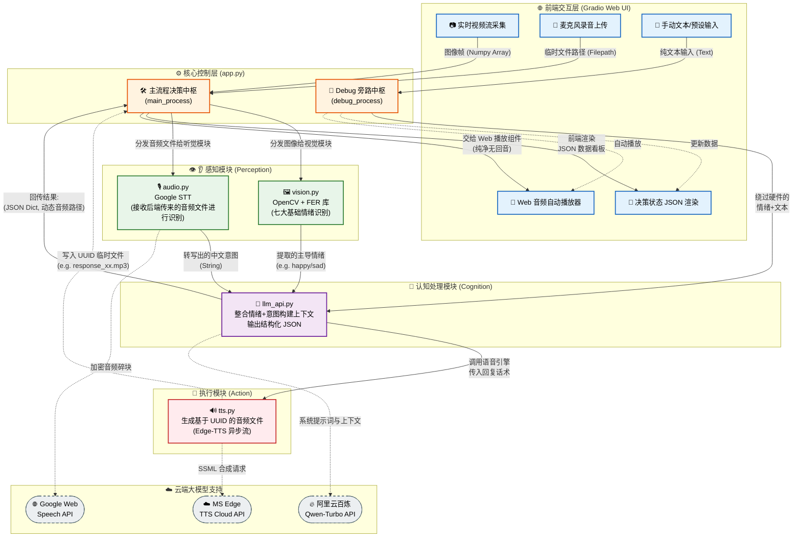

# 🤖 暖暖情感机器人系统架构图 (V2 重构版)

以下为当前经过“前端-服务端分离”与“高并发文件处理”改造后的最新系统架构图。

```mermaid
graph TD
    %% ================= 样式定义 =================
    classDef frontend fill:#E3F2FD,stroke:#1565C0,stroke-width:2px,color:#000
    classDef controller fill:#FFF3E0,stroke:#E65100,stroke-width:2px,color:#000
    classDef perception fill:#E8F5E9,stroke:#2E7D32,stroke-width:2px,color:#000
    classDef cognition fill:#F3E5F5,stroke:#6A1B9A,stroke-width:2px,color:#000
    classDef action fill:#FFEBEE,stroke:#C62828,stroke-width:2px,color:#000
    classDef external fill:#ECEFF1,stroke:#455A64,stroke-width:1px,stroke-dasharray: 5 5,color:#000

    %% ================= 模块节点 =================
    subgraph Frontend["🌐 前端交互层 (Gradio Web UI)"]
        UI_Cam["📷 实时视频流采集"]:::frontend
        UI_Mic["🎤 麦克风录音上传"]:::frontend
        UI_Txt["💬 手动文本/预设输入"]:::frontend
        UI_Video["📢 Web 音频自动播放器"]:::frontend
        UI_Info["🧠 决策状态 JSON 渲染"]:::frontend
    end

    subgraph Core["⚙️ 核心控制层 (app.py)"]
        Controller["🛠️ 主流程决策中枢<br>(main_process)"]:::controller
        Debug_Controller["🔧 Debug 旁路中枢<br>(debug_process)"]:::controller
    end

    subgraph Perception["👁️ 👂 感知模块 (Perception)"]
        Vision["🖼️ vision.py<br>OpenCV + FER 库<br>(七大基础情绪识别)"]:::perception
        Audio["🎙️ audio.py<br>Google STT<br>(接收后端传来的音频文件进行识别)"]:::perception
    end

    subgraph Cognition["🧠 认知处理模块 (Cognition)"]
        LLM["🤖 llm_api.py<br>整合情绪+意图构建上下文<br>输出结构化 JSON"]:::cognition
    end
    
    subgraph Action["🦾 执行模块 (Action)"]
        TTS["🔊 tts.py<br>生成基于 UUID 的音频文件<br>(Edge-TTS 异步流)"]:::action
    end

    %%外部 API
    subgraph External["☁️ 云端大模型支持"]
        Aliyun(["🔥 阿里云百炼<br>Qwen-Turbo API"]):::external
        Google(["🌐 Google Web<br>Speech API"]):::external
        EdgeCloud(["☁️ MS Edge<br>TTS Cloud API"]):::external
    end

    %% ================= 数据流向连线 =================
    %% 1. 前端 -> Controller
    UI_Cam -- "图像帧 (Numpy Array)" --> Controller
    UI_Mic -- "临时文件路径 (Filepath)" --> Controller
    UI_Txt -- "纯文本输入 (Text)" --> Debug_Controller
    
    %% 2. Controller -> Perception
    Controller -- "分发图像给视觉模块" --> Vision
    Controller -- "分发音频文件给听觉模块" --> Audio
    
    %% 3. Perception -> Cognition
    Vision -- "提取的主导情绪<br>(e.g. happy/sad)" --> LLM
    Audio -- "转写出的中文意图<br>(String)" --> LLM
    Debug_Controller -- "绕过硬件的<br>情绪+文本" --> LLM
    
    %% 4. Cognition -> Action & Controller
    LLM -- "调用语音引擎<br>传入回复话术" --> TTS
    LLM -- "回传结果:<br>(JSON Dict, 动态音频路径)" --> Controller
    
    %% 5. Action -> Controller -> Frontend
    TTS -.->|"写入 UUID 临时文件<br>(e.g. response_xx.mp3)"| Controller
    Controller -- "前端渲染<br>JSON 数据看板" --> UI_Info
    Controller -- "交给 Web 播放组件<br>(纯净无回音)" --> UI_Video
    
    Debug_Controller -.->|"更新数据"| UI_Info
    Debug_Controller -.->|"自动播放"| UI_Video

    %% 6. API 通信
    LLM -.->|"系统提示词与上下文"| Aliyun
    Audio -.->|"加密音频碎块"| Google
    TTS -.->|"SSML 合成请求"| EdgeCloud
```
